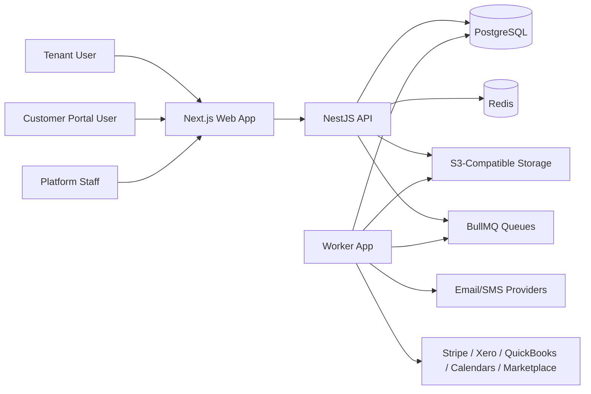

# System Architecture

## Architecture Summary

The platform is a modular monolith with three runtime applications sharing one relational data model and a common domain contract layer.



## Runtime Responsibilities

### Web

- renders ERP, platform admin, and customer portal UX
- handles authenticated navigation, command menu, dashboards, and forms
- uses typed API client contracts

### API

- owns business workflows and policy enforcement
- resolves tenant context and membership
- exposes versioned REST endpoints with OpenAPI docs
- emits domain events and schedules background jobs

### Worker

- processes emails, reminders, PDFs, imports, webhooks, and sync tasks
- enforces idempotency and retries
- updates job status telemetry and failure visibility

## Internal Module Topology

```text
identity: auth, users, roles, permissions, memberships
org: tenants, subscriptions, branches, teams, settings
crm: leads, customers, properties, tasks, appointments
operations: surveys, flooring, quotes, jobs, scheduling
stock: catalogue, pricing, inventory, purchasing, suppliers
finance: invoicing, payments, expenses
platform: documents, notifications, reports, audit, integrations, webhooks
```

## Architectural Rules

- Controllers stay thin and delegate to domain services.
- Domain services own workflow transitions and transactional operations.
- Repositories apply tenant scoping and return typed domain objects.
- Cross-module communication uses explicit service interfaces or domain events.
- Financial and stock-changing workflows run in database transactions.
