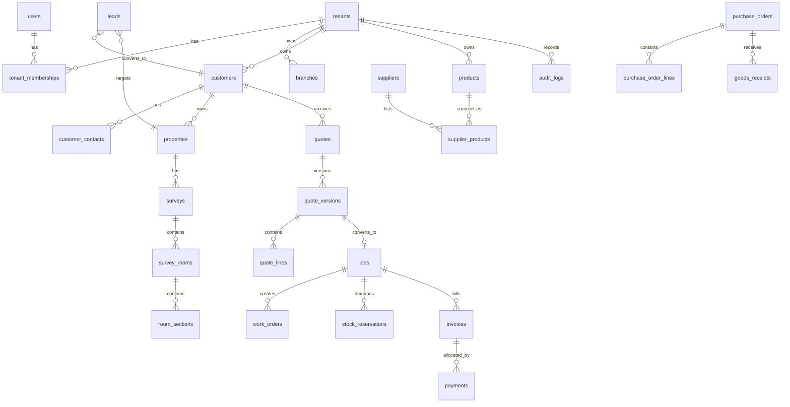

# Database Design

## Data Model Strategy

The schema is normalized around a shared ERP core with flooring-specific extensions. All tenant-owned entities include `tenant_id`, timestamps, and audit-friendly metadata.

## Core Entity Groups

### Identity And Access

- `users`
- `tenants`
- `tenant_memberships`
- `roles`
- `permissions`
- `role_permissions`
- `membership_roles`
- `user_sessions`

### Subscription And Platform Controls

- `subscription_plans`
- `features`
- `plan_features`
- `tenant_subscriptions`
- `tenant_feature_overrides`
- `feature_flags`

### Organisation

- `branches`
- `locations`
- `teams`
- `staff_profiles`
- `subcontractors`
- `number_sequences`
- `tenant_settings`

### CRM

- `leads`
- `lead_activities`
- `tasks`
- `appointments`
- `customers`
- `customer_contacts`
- `properties`

### Surveys And Flooring

- `surveys`
- `survey_rooms`
- `room_sections`
- `measurements`
- `moisture_readings`
- `waste_rules`
- `installation_rates`

### Catalogue And Suppliers

- `product_categories`
- `products`
- `product_variants`
- `units_of_measure`
- `suppliers`
- `supplier_products`
- `price_lists`
- `price_list_items`

### Quotes

- `quotes`
- `quote_versions`
- `quote_lines`
- `quote_options`
- `quote_acceptances`

### Jobs And Scheduling

- `jobs`
- `job_rooms`
- `work_orders`
- `job_assignments`
- `job_checklists`
- `job_checklist_items`
- `snags`

### Inventory And Purchasing

- `stock_locations`
- `stock_items`
- `stock_batches`
- `stock_rolls`
- `stock_remnants`
- `stock_movements`
- `stock_reservations`
- `purchase_orders`
- `purchase_order_lines`
- `goods_receipts`
- `goods_receipt_lines`
- `supplier_returns`

### Finance

- `invoices`
- `invoice_lines`
- `payments`
- `payment_allocations`
- `credit_notes`
- `expenses`

### Cross-Cutting

- `documents`
- `comments`
- `notifications`
- `notification_templates`
- `webhooks`
- `webhook_deliveries`
- `integrations`
- `integration_credentials`
- `audit_logs`
- `background_jobs`

## Key Constraints

- UUID primary keys on all tables
- `tenant_id` indexed for every tenant-owned table
- Composite unique keys for tenant numbering sequences
- Status enums on workflow entities
- Strong foreign keys on parent-child relations
- Check constraints for non-negative quantities and money

## High-Value Unique Indexes

- `quotes (tenant_id, quote_number)`
- `quote_versions (quote_id, version_number)`
- `invoices (tenant_id, invoice_number)`
- `branches (tenant_id, branch_code)`
- `products (tenant_id, sku)`
- `stock_locations (tenant_id, branch_id, code)`

## Retention Notes

- Audit logs are append-only and long-retained.
- Financial documents retain legal retention windows.
- Soft deletion is limited to user-facing records where recoverability matters.
- Sensitive documents use lifecycle rules and signed access patterns.

## ERD

